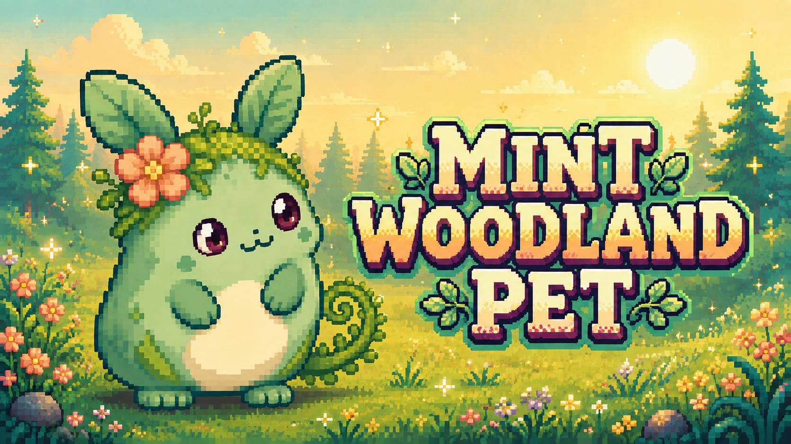
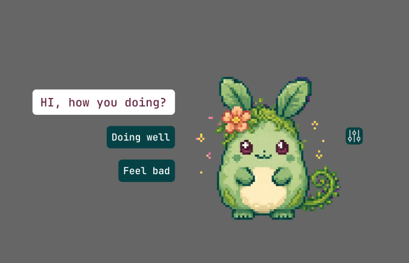

# Mint Woodland Pet

Mint Woodland Pet is a native Windows desktop companion. It stays near the edge
of the desktop, moves with the pointer when dragged, reacts to petting, offers
local two-choice conversations, and uses eleven prepared pixel-art loops.



The reusable marketing banner places a happy, curious Mint on the left looking toward the
pixel-art project title. Its warm morning woodland, crisp pixels, and soft ground
shadow were developed from the saved poster references while preserving the
active Mint character design. It is used as the GitHub README hero and can also
be used for external project promotion.


[Watch the combined animation loop](assets/mint-woodland-pet/qa/all-moods-loop-large.gif) ·
[Compare sprites with the reference](assets/mint-woodland-pet/qa/reference-comparison.png)

## UI reference



The desktop UI follows this saved reference: a white question bubble with plum
monospace text, two stacked dark-teal answers, and an 8 px rounded settings
button on the pet’s right. The reference is kept with the active character
assets so the layout can be checked again after future UI changes.

## What it does

- Starts in calm companion mode; questions remain until answered.
- Supports petting, smooth dragging, monitor switching, quiet mode, optional
  Windows voice, and a manual mood demo.
- Offers 230, 266, 300, and 333 px sizes. The 266 px size is the daily-use default.
- Keeps visible content above the taskbar and uses mixed-DPI-aware monitor coordinates.
- Runs locally: no account, network service, microphone, typing capture, or
  application-content inspection.

## Completed project changes

- Rebranded the application, executable, code, tools, documentation, and active
  asset paths as **Mint Woodland Pet**.
- Replaced the earlier character with the original mint woodland creature and
  archived the old yellow reference so it is not used for active artwork.
- Created and integrated 44 transparent sprite frames across eleven four-frame
  moods, plus runtime strips, loop previews, contact sheets, geometry checks,
  and reference-comparison material.
- Matched the approved compact desktop UI with a white question bubble, stacked
  dark-teal answers, plum monospace text, and an 8 px rounded settings button.
- Added automatic two-line wrapping and font fitting so long questions remain
  inside the fixed speech bubble while short questions keep the reference size.
- Made calm companion mode the default, kept unanswered questions stable,
  collapsed short rest messages after twelve seconds, and limited automatic
  check-ins to the resting state.
- Added smooth live dragging, visible-sprite hit bounds, taskbar-safe placement,
  monitor switching, per-monitor DPI awareness, and four pet-size presets.
- Added local branching conversations, twenty greetings, petting reactions,
  quiet mode, optional Windows voice, idle sleep, and a user-controlled mood demo.
- Added a reusable morning woodland banner, an optimized GitHub social preview,
  and saved visual references for future design checks.
- Open-sourced the software under MIT while keeping original character and
  marketing artwork under separate asset terms; added contribution, conduct,
  security, support, ownership, issue, and pull-request documentation.

## Run

Build first, then open:

```powershell
.\build\Release\MintWoodlandPet.exe
```

Use the sliders button to open settings for size, demo, quiet mode, voice,
monitor switching, a manual question, and close.

## Build and verify

Requires CMake 3.20+, Visual Studio 2022 C++ tools, and the Windows SDK.

```powershell
cmake -S . -B build -G "Visual Studio 17 2022" -A x64
cmake --build build --config Release
.\build\Release\MintWoodlandPet.exe --validate
.\build\Release\MintWoodlandPet.exe --self-test
.\build\Release\MintWoodlandPet.exe --render
```

The build copies `data/` and `assets/mint-woodland-pet/moods/` beside the
executable. Keep both folders with it if you move the app.

## How the animation loop was made

Each mood is a four-frame repeating pixel-art loop:

```text
raw 2×2 mood sheet
        ↓
prepare-mint-woodland-pet.cjs
        ↓
four transparent 96×96 frames
        ↓
one 384×96 horizontal strip
        ↓
MintWoodlandPet.exe displays frame 0 → 1 → 2 → 3 → 0
```

The preparation tool keeps the selected raw source, removes the magenta staging
background when needed, finds the clean cell separators, registers each frame at
the same scale, and writes both individual frames and the runtime strip. It also
creates GIF and contact-sheet previews for review.

At runtime, the loop is deliberately simple:

```cpp
const int frame = int(elapsed / moodDuration(mood)) % 4;
```

`elapsed` is time since the current mood began. Dividing by the frame duration
chooses a frame; `% 4` returns to frame zero after frame three. The selected
96×96 strip cell is scaled with nearest-neighbor sampling, keeping pixels crisp.

The eleven loops are `idle`, `look`, `wave`, `happy`, `sad`, `angry`, `sleep`,
`eat`, `drink`, `thirsty`, and `thunder`.

## Rebuild or validate sprite assets

Source artwork and review material live in `assets/mint-woodland-pet/`.
Preparation needs Node.js and Sharp:

```powershell
$env:MINT_WOODLAND_PET_SHARP_PATH = "path\to\sharp"
node tools/prepare-mint-woodland-pet.cjs
node tools/validate-mint-woodland-pet.cjs
```

The validator checks all 44 frames, alpha and bounds, frame distinctness,
strip dimensions, GIF loop metadata, and dialogue links.

## Open source and artwork rights

Copyright © 2026 sanfor2004.

The software source, build files, tools, dialogue data, and project documentation
outside `assets/` are open source under the [MIT License](LICENSE). The MIT terms
allow use, modification, and distribution while requiring the copyright and
permission notice to remain with substantial copies.

The Mint Woodland Pet character, sprites, animations, banner, social preview,
and other original visual assets are protected under the separate
[Asset Rights Notice](ASSET_LICENSE.md). They are available for building,
testing, and contributing to this project, but they are not released as reusable
standalone artwork. Historical and poster inspiration images are reference-only;
rights remain with their respective owners. See [NOTICE.md](NOTICE.md) for the
complete repository boundary.

Contributions are welcome. Read [CONTRIBUTING.md](CONTRIBUTING.md), the
[Code of Conduct](CODE_OF_CONDUCT.md), and [Security Policy](SECURITY.md) before
opening a pull request or sensitive report. Repository changes are routed to
`@sanfor2004` for review through `.github/CODEOWNERS`.

## Project map

| Path | Purpose |
| --- | --- |
| `src/main.cpp` | Win32 window, drawing, behavior, input, animation, and UI. |
| `src/json.h` | Small JSON parser used for dialogue. |
| `data/conversations.json` | Questions, answers, branches, and matching moods. |
| `assets/mint-woodland-pet/moods/` | Runtime sprites and horizontal strips. |
| `assets/mint-woodland-pet/marketing/` | External banner, 1280×640 social preview, and future project artwork. |
| `assets/mint-woodland-pet/reference/poster/` | Saved morning and pixel-title design references. |
| `assets/mint-woodland-pet/qa/` | Contact sheets, GIF loops, checks, and review notes. |
| `tools/` | Asset preparation and validation scripts. |
| `docs/` | Product specification, delivery plan, technical notes, and validation record. |
| `.github/` | Issue forms and the pull request checklist. |

## Documentation

- [Product brief](docs/PRODUCT_BRIEF.md)
- [Project specification](docs/PROJECT_SPEC.md)
- [Technical plan](docs/TECHNICAL_PLAN.md)
- [Delivery plan](docs/DELIVERY_PLAN.md)
- [Open decisions](docs/OPEN_DECISIONS.md)
- [Validation record](docs/VALIDATION.md)
- [Commented C++ source](src/main.cpp)
- [License and copyright boundary](NOTICE.md)
- [Contributing guide](CONTRIBUTING.md)
- [Support guide](SUPPORT.md)
