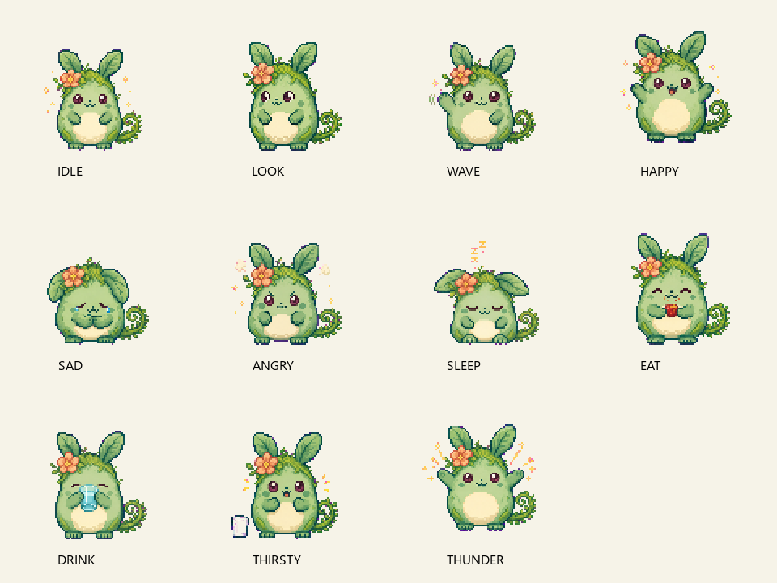

# Mint Woodland Pet

Mint Woodland Pet is a native Windows desktop companion. It stays near the edge
of the desktop, moves with the pointer when dragged, reacts to petting, offers
local two-choice conversations, and uses eleven prepared pixel-art loops.

The repository folder remains `Pikachu-Pet` for continuity. The active product,
runtime, assets, tools, UI, and documentation use **Mint Woodland Pet**.



[Watch the combined animation loop](assets/mint-woodland-pet/qa/all-moods-loop-large.gif) ·
[Compare sprites with the reference](assets/mint-woodland-pet/qa/reference-comparison.png)

## What it does

- Starts in calm companion mode; questions remain until answered.
- Supports petting, smooth dragging, monitor switching, quiet mode, optional
  Windows voice, and a manual mood demo.
- Offers 230, 266, 300, and 333 px sizes. The 266 px size is the daily-use default.
- Keeps visible content above the taskbar and uses mixed-DPI-aware monitor coordinates.
- Runs locally: no account, network service, microphone, typing capture, or
  application-content inspection.

## Run

Build first, then open:

```powershell
.\build\Release\MintWoodlandPet.exe
```

Use the sliders button to open settings for size, demo, quiet mode, voice,
monitor switching, a manual question, and close.

## Build and verify

Requires CMake 3.20+, Visual Studio 2022 C++ tools, and the Windows SDK.

```powershell
cmake -S . -B build -G "Visual Studio 17 2022" -A x64
cmake --build build --config Release
.\build\Release\MintWoodlandPet.exe --validate
.\build\Release\MintWoodlandPet.exe --self-test
.\build\Release\MintWoodlandPet.exe --render
```

The build copies `data/` and `assets/mint-woodland-pet/moods/` beside the
executable. Keep both folders with it if you move the app.

## How the animation loop was made

Each mood is a four-frame repeating pixel-art loop:

```text
raw 2×2 mood sheet
        ↓
prepare-mint-woodland-pet.cjs
        ↓
four transparent 96×96 frames
        ↓
one 384×96 horizontal strip
        ↓
MintWoodlandPet.exe displays frame 0 → 1 → 2 → 3 → 0
```

The preparation tool keeps the selected raw source, removes the magenta staging
background when needed, finds the clean cell separators, registers each frame at
the same scale, and writes both individual frames and the runtime strip. It also
creates GIF and contact-sheet previews for review.

At runtime, the loop is deliberately simple:

```cpp
const int frame = int(elapsed / moodDuration(mood)) % 4;
```

`elapsed` is time since the current mood began. Dividing by the frame duration
chooses a frame; `% 4` returns to frame zero after frame three. The selected
96×96 strip cell is scaled with nearest-neighbor sampling, keeping pixels crisp.

The eleven loops are `idle`, `look`, `wave`, `happy`, `sad`, `angry`, `sleep`,
`eat`, `drink`, `thirsty`, and `thunder`.

## Rebuild or validate sprite assets

Source artwork and review material live in `assets/mint-woodland-pet/`.
Preparation needs Node.js and Sharp:

```powershell
$env:MINT_WOODLAND_PET_SHARP_PATH = "path\to\sharp"
node tools/prepare-mint-woodland-pet.cjs
node tools/validate-mint-woodland-pet.cjs
```

The validator checks all 44 frames, alpha and bounds, frame distinctness,
strip dimensions, GIF loop metadata, and dialogue links.

## Project map

| Path | Purpose |
| --- | --- |
| `src/main.cpp` | Win32 window, drawing, behavior, input, animation, and UI. |
| `src/json.h` | Small JSON parser used for dialogue. |
| `data/conversations.json` | Questions, answers, branches, and matching moods. |
| `assets/mint-woodland-pet/moods/` | Runtime sprites and horizontal strips. |
| `assets/mint-woodland-pet/qa/` | Contact sheets, GIF loops, checks, and review notes. |
| `tools/` | Asset preparation and validation scripts. |
| `docs/` | Product specification, delivery plan, technical notes, and validation record. |

## Documentation

- [Product brief](docs/PRODUCT_BRIEF.md)
- [Project specification](docs/PROJECT_SPEC.md)
- [Technical plan](docs/TECHNICAL_PLAN.md)
- [Delivery plan](docs/DELIVERY_PLAN.md)
- [Open decisions](docs/OPEN_DECISIONS.md)
- [Validation record](docs/VALIDATION.md)
- [Commented C++ source](src/main.cpp)
